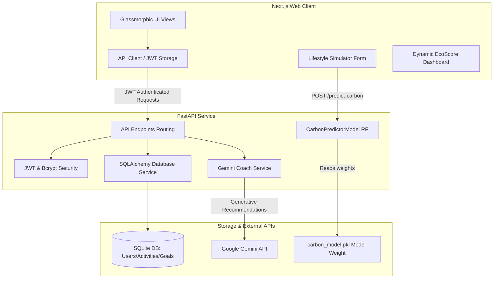

# EcoTrackr

> **Track. Understand. Reduce.**

EcoTrackr is a full-stack sustainability platform designed to help individuals understand, track, and dynamically reduce their daily carbon footprint. Empowered by a **Random Forest Regressor** machine learning model and a **Gemini-powered AI Sustainability Coach**, EcoTrackr turns lifestyle metrics into actionable, eco-friendly plans.

---

## 🚀 Key Features

* **Real-time Carbon Footprint Prediction**: Instantly estimates your daily footprint based on lifestyle behaviors using our custom Random Forest model.
* **Intelligent AI Coach**: Provides personalized suggestions, estimated CO₂ savings, and a structured weekly reduction action plan using Google Gemini.
* **Interactive Dynamic Dashboard**: Displays monthly emission breakdowns, historic tracking graphs, weekly comparison reports, and tree absorption equivalents.
* **Goal & Challenge Tracker**: Scopes personal challenges (e.g. "No Car Day") and targets, updating progression metrics in real time.
* **OCR Receipt Scanner**: Upload utility bills or flight receipts to extract usage and auto-log carbon activities.
* **Route Green-Optimizer**: Compares multiple modes of transportation (Walk, Bike, Metro, Car) for any route to pick the lowest emission alternative.
* **User Authentication**: Secure JWT-token authorization with password encryption for personalized profiles and leaderboards.

---

## 📊 Machine Learning Model

EcoTrackr integrates a **Random Forest Regressor** trained on the *Personal Carbon Footprint Behavior Dataset* (1,400 records) to predict a user's daily emissions.

### Dataset Features Used:
* `day_type` (Weekday vs. Weekend)
* `transport_mode` (Personal Car, Public Transit, Bicycle, Walking, Flight)
* `distance_km` (Daily distance traveled)
* `electricity_kwh` (Daily home power usage)
* `renewable_usage_pct` (Ratio of green energy consumption)
* `food_type` (Non-Veg, Vegetarian, Vegan)
* `screen_time_hours` (Daily electronic screen usage)
* `waste_generated_kg` (Daily waste output)
* `eco_actions` (Number of active green activities completed)

### Performance Evaluation:
* **Mean Absolute Error (MAE)**: `0.5052`
* **Root Mean Squared Error (RMSE)**: `0.6555`
* **R² Score**: `0.9430` *(Explains 94.3% of the variance)*

*Note: Built with a custom, pure Python/Numpy predictor class to secure absolute compatibility across local environments and serverless containers, bypassing AppLocker C-extension constraints.*

---

## 🛠️ Technology Stack

### Frontend
* **Core**: Next.js 16 (App Router, Turbopack) & React 19
* **Styling**: TailwindCSS 4, Custom CSS, and Modern Glassmorphism layout
* **Icons & Charts**: Lucide React & Recharts
* **Interactions**: Canvas Confetti (for task completions)

### Backend
* **API Framework**: FastAPI (Python 3.11+)
* **Database**: SQLite & SQLAlchemy ORM
* **Security**: JWT (PyJWT) & native Bcrypt password hashing
* **Machine Learning**: Joblib & Numpy
* **AI Engine**: Google Generative AI (Gemini) SDK

---

## 🏗️ Architecture

EcoTrackr uses a decoupled client-server architecture. Below is the system blueprint illustrating data flow and module relationships:



---


## ⚙️ Local Development Setup

### 1. Clone the Project
```bash
git clone https://github.com/AryanEjantkar/EcoTrackr.git
cd EcoTrackr
```

### 2. Start the Backend API
1. Navigate to the backend directory:
   ```bash
   cd backend
   ```
2. Create a virtual environment and install packages:
   ```bash
   python -m venv venv
   source venv/bin/activate  # On Windows: venv\Scripts\activate
   pip install -r requirements.txt
   ```
3. Run the ML model training script to generate the regression weights:
   ```bash
   python train_model.py
   ```
4. Start the FastAPI development server:
   ```bash
   python run.py
   ```
   *The backend will be running on `http://127.0.0.1:8000` (Docs at `/docs`).*

### 3. Start the Frontend Application
1. In a new terminal window, navigate to the frontend directory:
   ```bash
   cd frontend
   ```
2. Install dependencies:
   ```bash
   npm install
   ```
3. Run the Next.js development server:
   ```bash
   npm run dev
   ```
   *The website will be running locally on `http://localhost:3000`.*

---

## ☁️ Hugging Face Spaces Deployment (Docker)

EcoTrackr is pre-configured with a root `Dockerfile` and `start.sh` script to run both the FastAPI API and Next.js frontend concurrently inside a single container on Hugging Face Spaces.

1. Create a new Space on [Hugging Face Spaces](https://huggingface.co/new-space).
2. Configure settings:
   - **SDK**: Select **Docker** (Template: **Blank**).
   - **Visibility**: Public.
3. Add the Hugging Face repository remote to your local directory:
   ```bash
   git remote add hf https://huggingface.co/spaces/YOUR_USERNAME/YOUR_SPACE_NAME
   ```
4. Push and trigger the container build:
   ```bash
   git push -f hf main
   ```
   *Hugging Face will build the Next.js production bundle, train the carbon model, and deploy the application automatically.*
